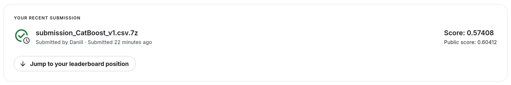

# Favorita Grocery Sales Forecasting

## Постановка задачи

Задача: предсказать продажи продуктов по данным Corporación Favorita.

Решение оценивается по NWRMSLE (Normalized Weighted Root Mean Squared Logarithmic Error):

$$
NWRMSLE = \sqrt{ \frac{\sum_{i=1}^n w_i \left( \ln(\hat{y}i + 1) - \ln(y_i +1)  \right)^2  }{\sum{i=1}^n w_i}}
$$

Где:

- $i$ - номер строки
- $\hat{y}_i$ - предсказанное количество продаж айтема
- $y_i$ - фактическое количество продаж айтема
- $n$ - общее количество строк в тестовом наборе
- $w_i$ - вес айтема

Веса айтемов содержатся в файле items.csv.

Попробуем решить эту задачу разными моделями по мере увеличения сложности модели:

1. Бэйзлайны
   - Naive
   - Seasonal Naive (7 дней)
   - AutoETS (сезон 7 дней)
   - AutoTheta (сезон 7 дней)
2. Основные модели
   - CatBoost
   - TFT

## Эксперименты

Для ускорения вычислений в ноутбуке favorita.ipynb была взята лишь часть данных: 1000 айтемов, 20384690 строк. Были взяты айтемы с наибольшим количеством данных, чтобы у моделей не было проблем с недостатком данных.

В ноутбуке были протестированы бэйзлайн модели, CatBoost и TFT.

Результаты метрики NWRMSLE на тестовых данных:

- Naive: 23.236
- SeasonalNaive_7: 20.229
- AutoETS_7: 15.898
- AutoTheta_7: 16.394
- CatBoost': 0.679
- TFT: 11.676

Эксперименты показали, что среди выбранных моделей для прогнозирования данного временного ряда лучше всего подходит **CatBoost**.

## Обучение модели

В файле `src/prepare_features.py` реализована обработка данных и генерация признаков.

В файле `src/train_model.py` реализовано обучение модели, прогнозирование на тестовых данных и вывод результатов в виде, подходящем для отправки на Kaggle.

## Запуск кода

- `make download-dataset` - загрузка датасета
- `make generate-features` - обработка датасета и генерация признаков
- `make train-model` - обучение модели
- `make run-model-on-test-data` - прогнозирование на тестовых данных
- `make tensorboard-logs` - запуск сервера tensorboard для просмотра логов обучения
- `make run-all` - запуск всех этапов: загрузка датасета, обучение, прогнозирование и запуск сервера tensorboard

## Результаты

Результат посылки на Kaggle:

